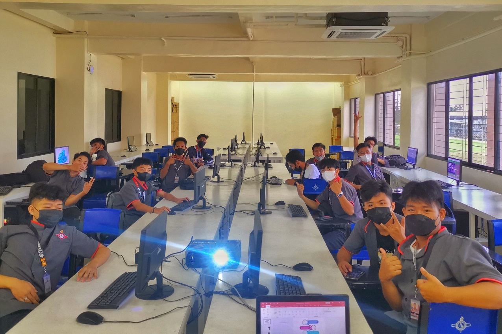

<html>
  
<h1> Joana M. Bernardino </h1>
<h1> IT Instructor / Professional</h1>

<body>

 I graduated in 2013 from Western Institute of Technology and I work as IT laboratory custodian and technician in the said institution for a year after. My professor as well as my department head encourage me to teach and share my knowledge of computers. I’m teaching senior high school, and college, especially in bachelor of science in information technology. I never expected that I will become an educator. 

 

In today’s world, because of the phenomenon of degree inflation, having a bachelor’s degree is 
still valued, but no longer seen as a mark of exceptional academic competence. Many people believe in a competitive workforce. With a growing demand for information technology experts, having an employee with a master's degree in IT can give additional points to an institution.

  

<h> My Expertise are: </h>
<ul>
  <li> Computer Hardware and Servicing</li>
  <li> Multimedia especially Adobe Applications </li>
  <li> Computer Networking </li>
  <li> Java Language </li>
</ul>

</body>
</html>

